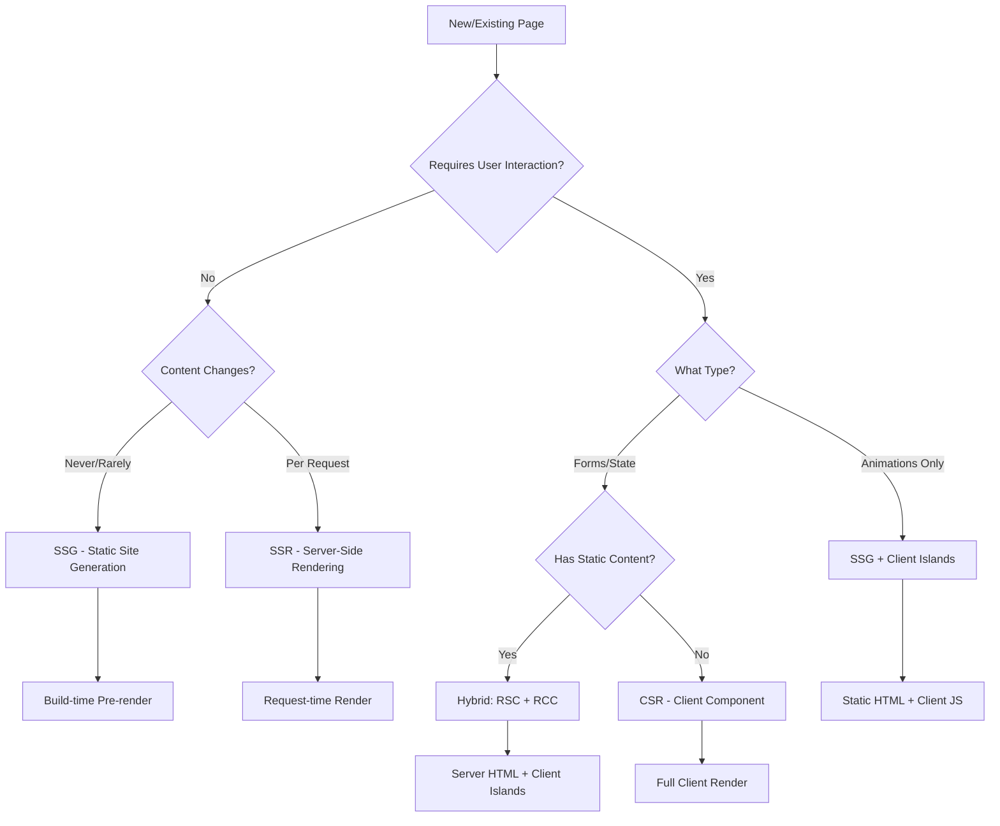

# Design Document: Next.js Rendering Optimization

## Overview

This design document outlines the technical approach for optimizing rendering strategies in a Next.js 16 (App Router) pedestrian traffic safety analysis dashboard. The optimization will convert pages from Client-Side Rendering (CSR) to more appropriate strategies: Static Site Generation (SSG) for static content, Server-Side Rendering (SSR) for dynamic content, and Hybrid approaches that combine React Server Components (RSC) with React Client Components (RCC).

The core principle is to minimize JavaScript sent to the client while maintaining all interactive functionality. We'll leverage Next.js 16's App Router features including React Server Components, streaming, and Suspense to achieve optimal performance.

### Key Design Principles

1. **Server-First Rendering**: Default to server components, use client components only when necessary
2. **Progressive Enhancement**: Ensure core content is available without JavaScript
3. **Minimal Client Boundaries**: Keep 'use client' directives as granular as possible
4. **Performance Budget**: Target 15-30% reduction in JavaScript bundle size
5. **Zero Functionality Loss**: All existing features must work identically after optimization

## Architecture

### Rendering Strategy Decision Tree



### Component Hierarchy Strategy

For each page, we'll establish a clear hierarchy:

1. **Root Layout** (Server Component) - Shared layout, metadata
2. **Page Component** (Server or Static) - Main page logic, data fetching
3. **Server Components** - Static content, data display, non-interactive elements
4. **Client Components** - Forms, animations, interactive widgets, third-party libraries requiring browser APIs

### Data Fetching Patterns

**Server-Side Data Fetching (SSR/SSG):**
```typescript
// In Server Component
async function getData() {
  const res = await fetch('http://localhost:3000/api/data', {
    cache: 'no-store' // SSR - always fresh
    // OR
    // next: { revalidate: 3600 } // ISR - revalidate every hour
  })
  return res.json()
}

export default async function Page() {
  const data = await getData()
  return <ServerComponent data={data} />
}
```

**Client-Side Data Fetching (for interactive updates):**
```typescript
'use client'
// In Client Component
function InteractiveWidget() {
  const [data, setData] = useState(null)
  
  useEffect(() => {
    fetch('/api/data').then(r => r.json()).then(setData)
  }, [])
  
  return <div>{/* interactive UI */}</div>
}
```

## Components and Interfaces

### 1. Home Page Optimization (SSG)

**Current Structure:**
```
app/(main)/page.tsx ('use client')
  └─> HomeClient component (client-side hooks, animations)
```

**Optimized Structure:**
```
app/(main)/page.tsx (Server Component - SSG)
  ├─> HomeHero (Server Component - static content)
  ├─> HomeFeatures (Server Component - static list)
  ├─> HomeTechStack (Server Component - static grid)
  └─> HomeAnimations (Client Component - scroll animations)
```

**Implementation Details:**

```typescript
// app/(main)/page.tsx (Server Component)
import { HomeHero } from '@/components/home/HomeHero'
import { HomeFeatures } from '@/components/home/HomeFeatures'
import { HomeTechStack } from '@/components/home/HomeTechStack'
import { HomeAnimations } from '@/components/home/HomeAnimations'

export const metadata = {
  title: 'Pedestrian Traffic Safety Analysis Dashboard',
  description: 'Analyze and improve pedestrian safety with data-driven insights',
}

export default function HomePage() {
  return (
    <div className="home-container">
      <HomeHero />
      <HomeFeatures />
      <HomeTechStack />
      <HomeAnimations />
    </div>
  )
}
```

```typescript
// components/home/HomeAnimations.tsx (Client Component)
'use client'

import { useInView } from 'react-intersection-observer'

export function HomeAnimations() {
  const [ref, inView] = useInView({ triggerOnce: true })
  
  return (
    <div ref={ref} className={inView ? 'animate-fade-in' : ''}>
      {/* Animation logic */}
    </div>
  )
}
```

**Data Flow:**
- No data fetching required (static content)
- Build-time generation creates static HTML
- Client component hydrates only for animations

### 2. Board List Page Optimization (SSR)

**Current Structure:**
```
app/(main)/board/page.tsx ('use client')
  └─> Client-side data fetching with filters, search, pagination
```

**Optimized Structure:**
```
app/(main)/board/page.tsx (Server Component - SSR)
  ├─> BoardHeader (Server Component)
  ├─> BoardFilters (Client Component - interactive controls)
  ├─> BoardList (Server Component - rendered with data)
  └─> BoardPagination (Client Component - navigation)
```

**Implementation Details:**

```typescript
// app/(main)/board/page.tsx (Server Component)
import { BoardFilters } from '@/components/board/BoardFilters'
import { BoardList } from '@/components/board/BoardList'
import { BoardPagination } from '@/components/board/BoardPagination'

interface PageProps {
  searchParams: {
    search?: string
    category?: string
    status?: string
    page?: string
  }
}

async function getSuggestions(params: PageProps['searchParams']) {
  const queryString = new URLSearchParams(params).toString()
  const res = await fetch(`http://localhost:3000/api/suggestions?${queryString}`, {
    cache: 'no-store' // Always fetch fresh data
  })
  
  if (!res.ok) throw new Error('Failed to fetch suggestions')
  return res.json()
}

export default async function BoardPage({ searchParams }: PageProps) {
  const data = await getSuggestions(searchParams)
  
  return (
    <div className="board-container">
      <BoardFilters initialFilters={searchParams} />
      <BoardList suggestions={data.suggestions} />
      <BoardPagination 
        currentPage={parseInt(searchParams.page || '1')}
        totalPages={data.totalPages}
      />
    </div>
  )
}
```

```typescript
// components/board/BoardFilters.tsx (Client Component)
'use client'

import { useRouter, useSearchParams } from 'next/navigation'
import { useState } from 'react'

export function BoardFilters({ initialFilters }) {
  const router = useRouter()
  const searchParams = useSearchParams()
  const [filters, setFilters] = useState(initialFilters)
  
  const handleFilterChange = (key: string, value: string) => {
    const params = new URLSearchParams(searchParams)
    params.set(key, value)
    router.push(`/board?${params.toString()}`)
  }
  
  return (
    <div className="filters">
      {/* Filter controls */}
    </div>
  )
}
```

**Data Flow:**
1. User navigates to /board?search=safety&page=2
2. Server receives request with searchParams
3. Server fetches data from API with parameters
4. Server renders complete HTML with data
5. Client hydrates interactive components (filters, pagination)
6. User interactions update URL and trigger server re-render

### 3. Dashboard Page Optimization (Hybrid)

**Current Structure:**
```
app/(main)/dashboard/page.tsx ('use client')
  ├─> Client-side KPI data fetching
  └─> Client-side map rendering (Leaflet)
```

**Optimized Structure:**
```
app/(main)/dashboard/page.tsx (Server Component - SSR)
  ├─> DashboardKPIs (Server Component - server-fetched data)
  ├─> DashboardStats (Server Component - server-fetched data)
  └─> DashboardMap (Client Component - Leaflet map)
```

**Implementation Details:**

```typescript
// app/(main)/dashboard/page.tsx (Server Component)
import { Suspense } from 'react'
import { DashboardKPIs } from '@/components/dashboard/DashboardKPIs'
import { DashboardStats } from '@/components/dashboard/DashboardStats'
import { DashboardMap } from '@/components/dashboard/DashboardMap'
import { DashboardSkeleton } from '@/components/dashboard/DashboardSkeleton'

async function getKPIData() {
  const res = await fetch('http://localhost:3000/api/dashboard/kpi', {
    cache: 'no-store'
  })
  if (!res.ok) throw new Error('Failed to fetch KPI data')
  return res.json()
}

async function getMapData() {
  const res = await fetch('http://localhost:3000/api/dashboard/provinces', {
    cache: 'no-store'
  })
  if (!res.ok) throw new Error('Failed to fetch map data')
  return res.json()
}

export default async function DashboardPage() {
  // Fetch data in parallel
  const [kpiData, mapData] = await Promise.all([
    getKPIData(),
    getMapData()
  ])
  
  return (
    <div className="dashboard-container">
      <Suspense fallback={<DashboardSkeleton />}>
        <DashboardKPIs data={kpiData} />
        <DashboardStats data={kpiData} />
      </Suspense>
      
      <DashboardMap initialData={mapData} />
    </div>
  )
}
```

```typescript
// components/dashboard/DashboardMap.tsx (Client Component)
'use client'

import dynamic from 'next/dynamic'
import { useState, useEffect } from 'react'

// Dynamically import Leaflet to avoid SSR issues
const MapComponent = dynamic(
  () => import('./MapComponent'),
  { ssr: false, loading: () => <div>Loading map...</div> }
)

export function DashboardMap({ initialData }) {
  const [mapData, setMapData] = useState(initialData)
  
  // Client-side updates for real-time data
  useEffect(() => {
    const interval = setInterval(async () => {
      const res = await fetch('/api/dashboard/provinces')
      const data = await res.json()
      setMapData(data)
    }, 30000) // Update every 30 seconds
    
    return () => clearInterval(interval)
  }, [])
  
  return <MapComponent data={mapData} />
}
```

**Data Flow:**
1. Server fetches KPI and map data in parallel
2. Server renders KPI components with data
3. Server sends HTML with embedded data to client
4. Client hydrates map component with initial data
5. Map component sets up real-time updates on client

### 4. Auth Pages Optimization (Partial)

**Current Structure:**
```
app/(main)/signin/page.tsx ('use client')
  └─> Full client component with form
```

**Optimized Structure:**
```
app/(main)/signin/page.tsx (Server Component)
  ├─> AuthHeader (Server Component - static content)
  ├─> AuthDescription (Server Component - static content)
  └─> SignInForm (Client Component - form logic)
```

**Implementation Details:**

```typescript
// app/(main)/signin/page.tsx (Server Component)
import { AuthHeader } from '@/components/auth/AuthHeader'
import { AuthDescription } from '@/components/auth/AuthDescription'
import { SignInForm } from '@/components/auth/SignInForm'

export const metadata = {
  title: 'Sign In - Pedestrian Safety Dashboard',
  description: 'Sign in to access the dashboard',
}

export default function SignInPage() {
  return (
    <div className="auth-container">
      <AuthHeader title="Welcome Back" />
      <AuthDescription text="Sign in to continue to your dashboard" />
      <SignInForm />
    </div>
  )
}
```

```typescript
// components/auth/SignInForm.tsx (Client Component)
'use client'

import { useState } from 'react'
import { useRouter } from 'next/navigation'

export function SignInForm() {
  const [email, setEmail] = useState('')
  const [password, setPassword] = useState('')
  const [error, setError] = useState('')
  const router = useRouter()
  
  const handleSubmit = async (e: React.FormEvent) => {
    e.preventDefault()
    
    const res = await fetch('/api/signin', {
      method: 'POST',
      headers: { 'Content-Type': 'application/json' },
      body: JSON.stringify({ email, password })
    })
    
    if (res.ok) {
      router.push('/dashboard')
    } else {
      setError('Invalid credentials')
    }
  }
  
  return (
    <form onSubmit={handleSubmit}>
      {/* Form fields */}
    </form>
  )
}
```

**Data Flow:**
- Server renders static content (header, description)
- Client hydrates form component
- Form submission handled client-side
- Reduced JavaScript bundle (only form logic)

### 5. Board Detail Page Optimization (SSR)

**Current Structure:**
```
app/(main)/board/[id]/page.tsx ('use client')
  └─> Client-side data fetching for suggestion details
```

**Optimized Structure:**
```
app/(main)/board/[id]/page.tsx (Server Component - SSR)
  ├─> SuggestionHeader (Server Component - title, metadata)
  ├─> SuggestionContent (Server Component - description, details)
  ├─> SuggestionComments (Server Component - initial comments)
  ├─> CommentForm (Client Component - add comment)
  └─> LikeButton (Client Component - like interaction)
```

**Implementation Details:**

```typescript
// app/(main)/board/[id]/page.tsx (Server Component)
import { notFound } from 'next/navigation'
import { SuggestionHeader } from '@/components/board/SuggestionHeader'
import { SuggestionContent } from '@/components/board/SuggestionContent'
import { SuggestionComments } from '@/components/board/SuggestionComments'
import { CommentForm } from '@/components/board/CommentForm'
import { LikeButton } from '@/components/board/LikeButton'

interface PageProps {
  params: { id: string }
}

async function getSuggestion(id: string) {
  const res = await fetch(`http://localhost:3000/api/suggestions/${id}`, {
    cache: 'no-store'
  })
  
  if (!res.ok) {
    if (res.status === 404) return null
    throw new Error('Failed to fetch suggestion')
  }
  
  return res.json()
}

export async function generateMetadata({ params }: PageProps) {
  const suggestion = await getSuggestion(params.id)
  
  if (!suggestion) return { title: 'Not Found' }
  
  return {
    title: suggestion.title,
    description: suggestion.description.substring(0, 160),
    openGraph: {
      title: suggestion.title,
      description: suggestion.description,
      type: 'article',
      url: `https://example.com/board/${params.id}`,
    },
  }
}

export default async function SuggestionDetailPage({ params }: PageProps) {
  const suggestion = await getSuggestion(params.id)
  
  if (!suggestion) notFound()
  
  return (
    <div className="suggestion-detail">
      <SuggestionHeader 
        title={suggestion.title}
        author={suggestion.author}
        createdAt={suggestion.createdAt}
      />
      
      <SuggestionContent 
        description={suggestion.description}
        category={suggestion.category}
        status={suggestion.status}
      />
      
      <LikeButton 
        suggestionId={suggestion.id}
        initialLikes={suggestion.likes}
      />
      
      <SuggestionComments comments={suggestion.comments} />
      <CommentForm suggestionId={suggestion.id} />
    </div>
  )
}
```

```typescript
// components/board/LikeButton.tsx (Client Component)
'use client'

import { useState } from 'react'

export function LikeButton({ suggestionId, initialLikes }) {
  const [likes, setLikes] = useState(initialLikes)
  const [isLiked, setIsLiked] = useState(false)
  
  const handleLike = async () => {
    const res = await fetch(`/api/suggestions/${suggestionId}/like`, {
      method: 'POST'
    })
    
    if (res.ok) {
      setLikes(likes + (isLiked ? -1 : 1))
      setIsLiked(!isLiked)
    }
  }
  
  return (
    <button onClick={handleLike}>
      {isLiked ? 'Unlike' : 'Like'} ({likes})
    </button>
  )
}
```

**Data Flow:**
1. User navigates to /board/123
2. Server fetches suggestion data
3. Server generates dynamic metadata for SEO
4. Server renders complete HTML with suggestion details
5. Client hydrates interactive components (like button, comment form)
6. User interactions update via API calls

## Data Models

### Page Configuration Model

```typescript
interface PageConfig {
  path: string
  renderingStrategy: 'SSG' | 'SSR' | 'CSR' | 'Hybrid'
  cacheStrategy: 'force-cache' | 'no-store' | { revalidate: number }
  serverComponents: string[]
  clientComponents: string[]
  dataFetchingPattern: 'server' | 'client' | 'both'
}
```

### Performance Metrics Model

```typescript
interface PerformanceMetrics {
  pagePath: string
  before: {
    fcp: number // First Contentful Paint (ms)
    lcp: number // Largest Contentful Paint (ms)
    tti: number // Time to Interactive (ms)
    bundleSize: number // JavaScript bundle size (KB)
  }
  after: {
    fcp: number
    lcp: number
    tti: number
    bundleSize: number
  }
  improvements: {
    fcpImprovement: number // percentage
    lcpImprovement: number // percentage
    ttiImprovement: number // percentage
    bundleSizeReduction: number // percentage
  }
}
```

### Component Boundary Model

```typescript
interface ComponentBoundary {
  componentName: string
  type: 'server' | 'client'
  reason: string // Why this boundary was chosen
  dependencies: string[] // External dependencies
  interactivity: 'none' | 'low' | 'high'
  dataSource: 'static' | 'server-fetch' | 'client-fetch'
}
```

## Data Models (continued)

### Loading State Model

```typescript
interface LoadingState {
  pagePath: string
  loadingComponent: string // Path to loading.tsx
  suspenseBoundaries: {
    componentName: string
    fallback: string
    estimatedLoadTime: number // ms
  }[]
  streamingEnabled: boolean
}
```

### Error Handling Model

```typescript
interface ErrorBoundary {
  pagePath: string
  errorComponent: string // Path to error.tsx
  errorTypes: {
    type: '404' | '500' | 'network' | 'validation'
    message: string
    recovery: 'retry' | 'redirect' | 'fallback'
  }[]
}
```


## Correctness Properties

*A property is a characteristic or behavior that should hold true across all valid executions of a system—essentially, a formal statement about what the system should do. Properties serve as the bridge between human-readable specifications and machine-verifiable correctness guarantees.*

### Property 1: Animation Preservation

*For any* visual animation or scroll-based interaction on the Home page, the behavior after optimization should be identical to the behavior before optimization.

**Validates: Requirements 1.7**

### Property 2: Server-Side Filter Application

*For any* valid combination of search parameters (search query, category, status, page number) on the Board page, the server-rendered HTML should contain the correctly filtered and paginated suggestion list.

**Validates: Requirements 2.3**

### Property 3: Board Functionality Preservation

*For any* filtering, searching, or pagination operation on the Board page, the results after optimization should be identical to the results before optimization.

**Validates: Requirements 2.6**

### Property 4: Map Interaction Preservation

*For any* map interaction (zoom, pan, marker click, layer toggle) on the Dashboard page, the behavior after optimization should be identical to the behavior before optimization.

**Validates: Requirements 3.6**

### Property 5: Form Behavior Preservation

*For any* form input, validation rule, or submission scenario on Auth pages, the behavior after optimization should be identical to the behavior before optimization, including all error handling and state management.

**Validates: Requirements 4.5, 4.6**

### Property 6: Open Graph Metadata Completeness

*For any* suggestion detail page, the HTML should contain complete Open Graph metadata (title, description, type, url, image) that accurately reflects the suggestion content.

**Validates: Requirements 5.5**

### Property 7: Interactive Feature Preservation

*For any* interactive feature (comment submission, like button, real-time updates) on suggestion detail pages, the behavior after optimization should be identical to the behavior before optimization.

**Validates: Requirements 5.6**

### Property 8: Time to Interactive Improvement

*For all* optimized pages, the Time to Interactive (TTI) metric after optimization should be less than or equal to the TTI before optimization (no regressions).

**Validates: Requirements 6.5**

### Property 9: Performance Metric Non-Regression

*For all* performance metrics (FCP, LCP, TTI, CLS, bundle size) across all pages, the values after optimization should be equal to or better than the values before optimization.

**Validates: Requirements 6.6**

### Property 10: User Interaction Consistency

*For any* user interaction on any optimized page, the resulting behavior, state changes, and visual feedback should be identical to the original implementation.

**Validates: Requirements 8.2**

### Property 11: API Integration Preservation

*For any* API call made by the application, the request parameters, response handling, and error handling after optimization should be identical to the original implementation.

**Validates: Requirements 8.3**

### Property 12: Error Handling Preservation

*For any* error scenario (network error, validation error, 404, 500), the error messages, recovery options, and user feedback after optimization should be identical to the original implementation.

**Validates: Requirements 8.4, 8.6**

### Property 13: Authentication Preservation

*For any* authentication or authorization check, the behavior after optimization should be identical to the original implementation, including redirects, access control, and session management.

**Validates: Requirements 8.5**

### Property 14: Loading Indicator Display

*For all* pages with server-side data fetching, appropriate loading indicators should be displayed during the fetch operation.

**Validates: Requirements 9.2**

### Property 15: Error Message User-Friendliness

*For any* server-side error, the displayed error message should be user-friendly (no stack traces, technical jargon, or sensitive information exposed).

**Validates: Requirements 9.4**

### Property 16: Client Loading State Preservation

*For any* client-side interaction that triggers loading states, the loading indicators after optimization should be identical to the original implementation.

**Validates: Requirements 9.7**

### Property 17: HTML Completeness for Public Pages

*For all* public pages (Home, Board list, Board details), the initial HTML response should contain complete, fully-rendered content that is readable without JavaScript execution.

**Validates: Requirements 10.1, 10.2**

### Property 18: Metadata Completeness

*For all* public pages, the HTML should contain proper metadata including title, description, and Open Graph tags.

**Validates: Requirements 10.3, 10.6**

### Property 19: Dynamic Metadata Accuracy

*For any* board detail page, the generated metadata (title, description, Open Graph tags) should accurately reflect the specific suggestion content.

**Validates: Requirements 10.4**

### Property 20: Structured Data Validity

*For all* suggestion listing and detail pages, the HTML should contain valid JSON-LD structured data that conforms to schema.org specifications.

**Validates: Requirements 10.5**

### Property 21: Link Crawlability

*For all* internal links on public pages, the links should be present in the initial HTML as standard anchor tags without requiring JavaScript execution.

**Validates: Requirements 10.7**

## Error Handling

### Server-Side Error Handling

**Error Boundaries:**
Each page using SSR or SSG will have an `error.tsx` file that catches and handles errors gracefully:

```typescript
// app/(main)/board/error.tsx
'use client'

export default function BoardError({
  error,
  reset,
}: {
  error: Error & { digest?: string }
  reset: () => void
}) {
  return (
    <div className="error-container">
      <h2>Something went wrong loading suggestions</h2>
      <p>We're having trouble loading the suggestion board. Please try again.</p>
      <button onClick={reset}>Try again</button>
    </div>
  )
}
```

**Not Found Handling:**
For dynamic routes, implement `not-found.tsx` for 404 errors:

```typescript
// app/(main)/board/[id]/not-found.tsx
export default function SuggestionNotFound() {
  return (
    <div className="not-found-container">
      <h2>Suggestion Not Found</h2>
      <p>The suggestion you're looking for doesn't exist or has been removed.</p>
      <a href="/board">Back to Board</a>
    </div>
  )
}
```

**API Error Handling:**
Server-side data fetching should handle errors gracefully:

```typescript
async function getSuggestions() {
  try {
    const res = await fetch('http://localhost:3000/api/suggestions', {
      cache: 'no-store'
    })
    
    if (!res.ok) {
      // Log error for monitoring
      console.error('Failed to fetch suggestions:', res.status)
      
      // Return empty state rather than throwing
      return { suggestions: [], totalPages: 0 }
    }
    
    return res.json()
  } catch (error) {
    // Network errors
    console.error('Network error fetching suggestions:', error)
    return { suggestions: [], totalPages: 0 }
  }
}
```

### Client-Side Error Handling

**Client Component Errors:**
Client components should maintain existing error handling:

```typescript
'use client'

export function CommentForm({ suggestionId }) {
  const [error, setError] = useState<string | null>(null)
  
  const handleSubmit = async (e: React.FormEvent) => {
    e.preventDefault()
    setError(null)
    
    try {
      const res = await fetch(`/api/suggestions/${suggestionId}/comments`, {
        method: 'POST',
        body: JSON.stringify({ comment })
      })
      
      if (!res.ok) {
        const data = await res.json()
        setError(data.message || 'Failed to submit comment')
        return
      }
      
      // Success handling
    } catch (error) {
      setError('Network error. Please check your connection.')
    }
  }
  
  return (
    <form onSubmit={handleSubmit}>
      {error && <div className="error-message">{error}</div>}
      {/* Form fields */}
    </form>
  )
}
```

### Loading States

**Server Component Loading:**
Implement `loading.tsx` for server-side loading states:

```typescript
// app/(main)/board/loading.tsx
export default function BoardLoading() {
  return (
    <div className="board-skeleton">
      <div className="skeleton-header" />
      <div className="skeleton-filters" />
      <div className="skeleton-list">
        {[...Array(10)].map((_, i) => (
          <div key={i} className="skeleton-item" />
        ))}
      </div>
    </div>
  )
}
```

**Suspense Boundaries:**
Use Suspense for streaming components:

```typescript
import { Suspense } from 'react'

export default function DashboardPage() {
  return (
    <div>
      <Suspense fallback={<KPISkeleton />}>
        <DashboardKPIs />
      </Suspense>
      
      <Suspense fallback={<MapSkeleton />}>
        <DashboardMap />
      </Suspense>
    </div>
  )
}
```

## Testing Strategy

### Dual Testing Approach

This optimization requires both **unit tests** and **property-based tests** to ensure comprehensive coverage:

- **Unit tests**: Verify specific examples, edge cases, and error conditions
- **Property tests**: Verify universal properties across all inputs

Both testing approaches are complementary and necessary. Unit tests catch concrete bugs in specific scenarios, while property tests verify general correctness across a wide range of inputs.

### Property-Based Testing Configuration

**Library Selection:**
- **JavaScript/TypeScript**: Use `fast-check` library for property-based testing
- Install: `npm install --save-dev fast-check @types/fast-check`

**Test Configuration:**
- Each property test must run a minimum of 100 iterations
- Each test must reference its design document property
- Tag format: `Feature: nextjs-rendering-optimization, Property {number}: {property_text}`

**Example Property Test:**

```typescript
// __tests__/board.property.test.ts
import fc from 'fast-check'
import { render } from '@testing-library/react'
import { BoardPage } from '@/app/(main)/board/page'

describe('Board Page Properties', () => {
  // Feature: nextjs-rendering-optimization, Property 2: Server-Side Filter Application
  test('server-side filter application', async () => {
    await fc.assert(
      fc.asyncProperty(
        fc.record({
          search: fc.string(),
          category: fc.constantFrom('safety', 'infrastructure', 'education'),
          status: fc.constantFrom('pending', 'approved', 'rejected'),
          page: fc.integer({ min: 1, max: 100 })
        }),
        async (searchParams) => {
          // Fetch server-rendered HTML
          const html = await renderToString(<BoardPage searchParams={searchParams} />)
          
          // Verify HTML contains filtered results
          const expectedResults = await getExpectedResults(searchParams)
          
          for (const result of expectedResults) {
            expect(html).toContain(result.title)
          }
        }
      ),
      { numRuns: 100 }
    )
  })
  
  // Feature: nextjs-rendering-optimization, Property 3: Board Functionality Preservation
  test('board functionality preservation', async () => {
    await fc.assert(
      fc.asyncProperty(
        fc.record({
          search: fc.string(),
          category: fc.option(fc.constantFrom('safety', 'infrastructure', 'education')),
          page: fc.integer({ min: 1, max: 10 })
        }),
        async (params) => {
          // Get results from optimized version
          const optimizedResults = await getOptimizedResults(params)
          
          // Get results from original version (baseline)
          const originalResults = await getOriginalResults(params)
          
          // Results should be identical
          expect(optimizedResults).toEqual(originalResults)
        }
      ),
      { numRuns: 100 }
    )
  })
})
```

### Unit Testing Strategy

**Component Testing:**
Test individual components in isolation:

```typescript
// __tests__/components/BoardFilters.test.tsx
import { render, fireEvent, screen } from '@testing-library/react'
import { BoardFilters } from '@/components/board/BoardFilters'

describe('BoardFilters', () => {
  test('updates URL when filter changes', () => {
    const mockPush = jest.fn()
    jest.mock('next/navigation', () => ({
      useRouter: () => ({ push: mockPush }),
      useSearchParams: () => new URLSearchParams()
    }))
    
    render(<BoardFilters initialFilters={{}} />)
    
    const categorySelect = screen.getByLabelText('Category')
    fireEvent.change(categorySelect, { target: { value: 'safety' } })
    
    expect(mockPush).toHaveBeenCalledWith('/board?category=safety')
  })
  
  test('handles empty search gracefully', () => {
    render(<BoardFilters initialFilters={{}} />)
    
    const searchInput = screen.getByPlaceholderText('Search suggestions')
    fireEvent.change(searchInput, { target: { value: '' } })
    fireEvent.submit(searchInput.closest('form'))
    
    // Should not add empty search param
    expect(mockPush).toHaveBeenCalledWith('/board')
  })
})
```

**Integration Testing:**
Test page-level integration:

```typescript
// __tests__/pages/board.test.tsx
import { render, screen } from '@testing-library/react'
import BoardPage from '@/app/(main)/board/page'

describe('Board Page', () => {
  test('renders suggestions from server', async () => {
    const mockSuggestions = [
      { id: 1, title: 'Test Suggestion 1' },
      { id: 2, title: 'Test Suggestion 2' }
    ]
    
    // Mock API response
    global.fetch = jest.fn(() =>
      Promise.resolve({
        ok: true,
        json: () => Promise.resolve({ suggestions: mockSuggestions, totalPages: 1 })
      })
    )
    
    const page = await BoardPage({ searchParams: {} })
    render(page)
    
    expect(screen.getByText('Test Suggestion 1')).toBeInTheDocument()
    expect(screen.getByText('Test Suggestion 2')).toBeInTheDocument()
  })
  
  test('handles API errors gracefully', async () => {
    global.fetch = jest.fn(() =>
      Promise.resolve({
        ok: false,
        status: 500
      })
    )
    
    const page = await BoardPage({ searchParams: {} })
    render(page)
    
    // Should render empty state, not crash
    expect(screen.getByText(/no suggestions/i)).toBeInTheDocument()
  })
})
```

### Performance Testing

**Lighthouse CI Integration:**
Add Lighthouse CI to measure Core Web Vitals:

```javascript
// lighthouserc.js
module.exports = {
  ci: {
    collect: {
      url: [
        'http://localhost:3000/',
        'http://localhost:3000/board',
        'http://localhost:3000/dashboard',
        'http://localhost:3000/board/1'
      ],
      numberOfRuns: 3
    },
    assert: {
      assertions: {
        'categories:performance': ['error', { minScore: 0.9 }],
        'first-contentful-paint': ['error', { maxNumericValue: 2000 }],
        'largest-contentful-paint': ['error', { maxNumericValue: 2500 }],
        'cumulative-layout-shift': ['error', { maxNumericValue: 0.1 }],
        'total-blocking-time': ['error', { maxNumericValue: 300 }]
      }
    },
    upload: {
      target: 'temporary-public-storage'
    }
  }
}
```

**Bundle Size Analysis:**
Use `@next/bundle-analyzer` to track bundle sizes:

```javascript
// next.config.js
const withBundleAnalyzer = require('@next/bundle-analyzer')({
  enabled: process.env.ANALYZE === 'true'
})

module.exports = withBundleAnalyzer({
  // Next.js config
})
```

Run analysis:
```bash
ANALYZE=true npm run build
```

### Visual Regression Testing

**Playwright for Visual Testing:**

```typescript
// __tests__/visual/home.spec.ts
import { test, expect } from '@playwright/test'

test('home page visual regression', async ({ page }) => {
  await page.goto('http://localhost:3000/')
  
  // Wait for animations to complete
  await page.waitForTimeout(1000)
  
  // Take screenshot and compare
  await expect(page).toHaveScreenshot('home-page.png', {
    maxDiffPixels: 100
  })
})

test('home page animations work', async ({ page }) => {
  await page.goto('http://localhost:3000/')
  
  // Scroll to trigger animations
  await page.evaluate(() => window.scrollBy(0, 500))
  
  // Verify animation classes are applied
  const animatedElement = page.locator('.animate-fade-in')
  await expect(animatedElement).toBeVisible()
})
```

### SEO Testing

**HTML Completeness Testing:**

```typescript
// __tests__/seo/html-completeness.test.ts
import { JSDOM } from 'jsdom'

describe('SEO - HTML Completeness', () => {
  test('home page has complete HTML without JavaScript', async () => {
    const response = await fetch('http://localhost:3000/')
    const html = await response.text()
    const dom = new JSDOM(html)
    const document = dom.window.document
    
    // Verify main content is present
    expect(document.querySelector('h1')).toBeTruthy()
    expect(document.querySelector('.features')).toBeTruthy()
    expect(document.querySelector('.tech-stack')).toBeTruthy()
    
    // Verify metadata
    expect(document.querySelector('meta[property="og:title"]')).toBeTruthy()
    expect(document.querySelector('meta[property="og:description"]')).toBeTruthy()
  })
  
  test('board detail page has dynamic metadata', async () => {
    const response = await fetch('http://localhost:3000/board/1')
    const html = await response.text()
    const dom = new JSDOM(html)
    const document = dom.window.document
    
    const ogTitle = document.querySelector('meta[property="og:title"]')?.getAttribute('content')
    const ogDescription = document.querySelector('meta[property="og:description"]')?.getAttribute('content')
    
    // Metadata should be specific to the suggestion
    expect(ogTitle).not.toBe('Pedestrian Traffic Safety Analysis Dashboard')
    expect(ogDescription).toBeTruthy()
    expect(ogDescription?.length).toBeGreaterThan(50)
  })
})
```

### Test Coverage Requirements

**Minimum Coverage Targets:**
- Unit test coverage: 80% of client components
- Property test coverage: All properties in design document
- Integration test coverage: All page routes
- Visual regression: All public pages
- SEO test coverage: All public pages

**Test Execution:**
```bash
# Run all tests
npm test

# Run property tests only
npm test -- --testPathPattern=property

# Run with coverage
npm test -- --coverage

# Run visual regression tests
npm run test:visual

# Run performance tests
npm run lighthouse
```

### Continuous Integration

**GitHub Actions Workflow:**

```yaml
# .github/workflows/test.yml
name: Test Optimization

on: [push, pull_request]

jobs:
  test:
    runs-on: ubuntu-latest
    
    steps:
      - uses: actions/checkout@v3
      - uses: actions/setup-node@v3
        with:
          node-version: '18'
      
      - name: Install dependencies
        run: npm ci
      
      - name: Run unit tests
        run: npm test -- --coverage
      
      - name: Run property tests
        run: npm test -- --testPathPattern=property
      
      - name: Build application
        run: npm run build
      
      - name: Start server
        run: npm start &
        
      - name: Wait for server
        run: npx wait-on http://localhost:3000
      
      - name: Run Lighthouse CI
        run: npm run lighthouse
      
      - name: Run visual regression tests
        run: npm run test:visual
      
      - name: Analyze bundle size
        run: ANALYZE=true npm run build
```

This comprehensive testing strategy ensures that all optimizations maintain functionality while improving performance.
